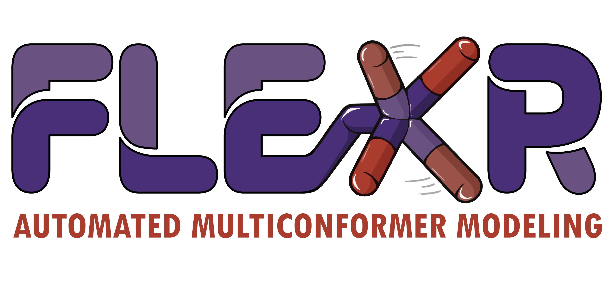
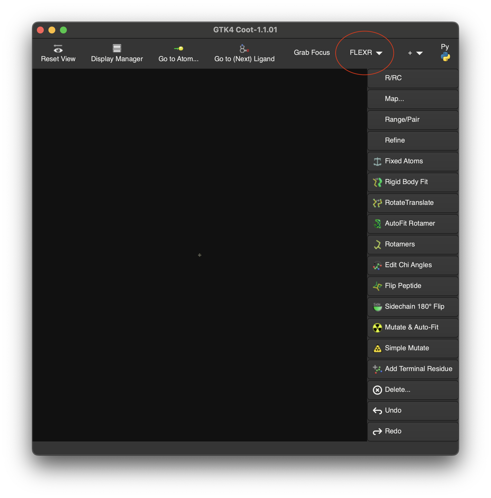
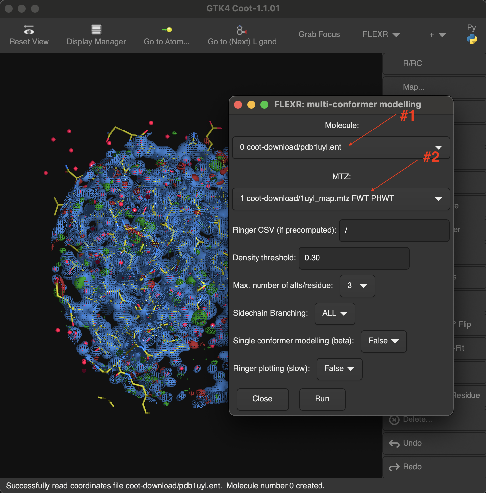
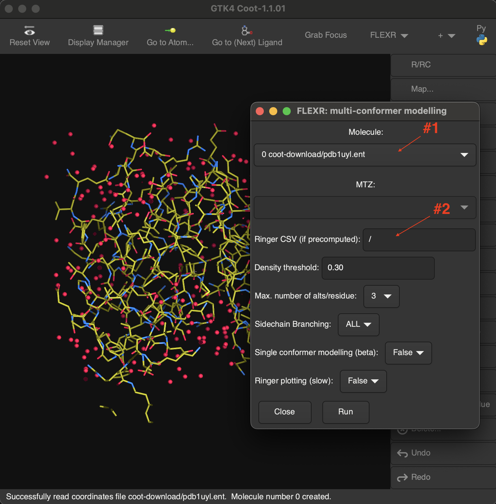
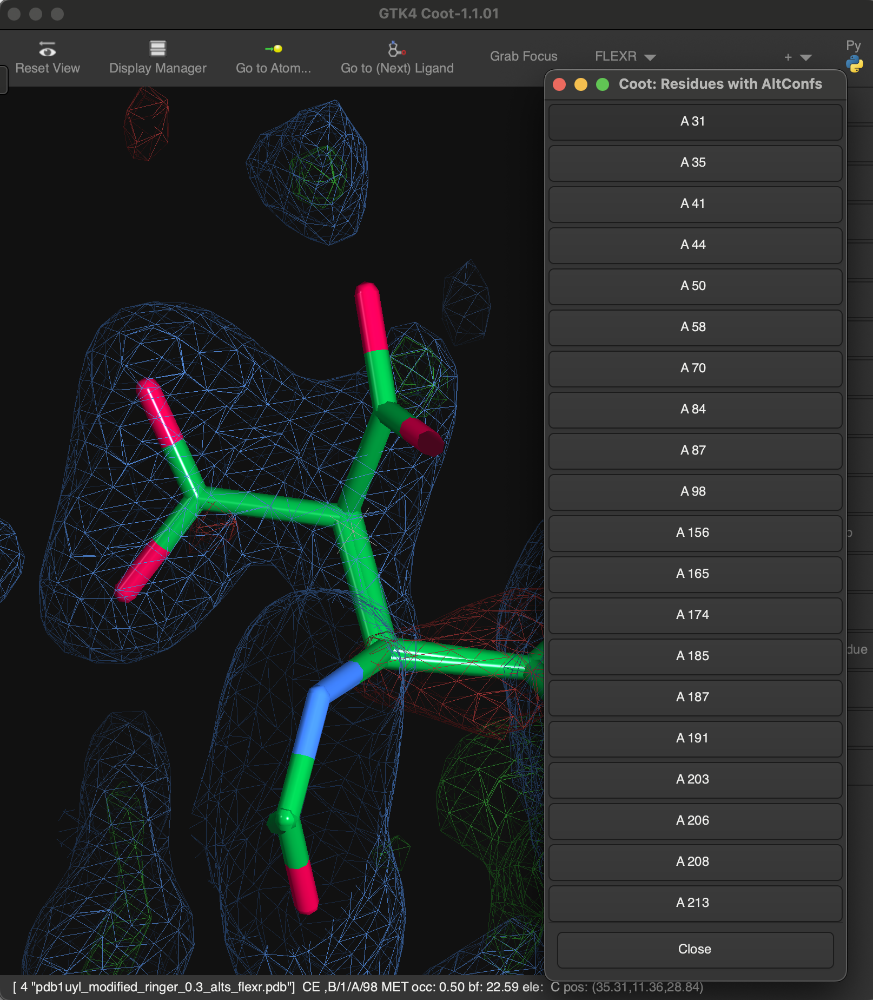

# FLEXR


`FLEXR-GUI` is a Coot1 plugin for [FLEXR](https://github.com/thefischerlab/flexr) - a multiconformer modeling tool.

If you use this software, please cite:

Stachowski, T. R. & Fischer, M.
[FLEXR: automated multi-conformer model building using electron-density map sampling.](https://doi.org/10.1107/S2059798323002498)
2023 Acta Cryst. D79.

## Installation

`FLEXR-GUI` was tested on Intel and M1 Macs running macOS Sonoma.
You will need the following tools installed and accessible in your path:

1. git
2. [Phenix](https://phenix-online.org) (Required to run Ringer)
3. [Homebrew](https://brew.sh)
4. [Coot1](https://github.com/pemsley/coot)

Once these are installed, you need to install these python libraries to the Homebrew python:
1. Install Python libraries (approximate path for M1 Macs):

```
/opt/homebrew/bin/python3.11 -m pip install pandas numpy scipy matplotlib
```

2. Clone the latest release of `FLEXR-GUI`:

```
git clone https://github.com/TheFischerLab/FLEXR-GUI.git
```

3. Move the contents of `FLEXR-GUI` into the Coot1 Python directory.

For example on M1 Macs, where `<version>` is the Coot1 version you installed:

```
cp -r ./FLEXR-GUI/* /opt/homebrew/Cellar/coot/<version>/lib/python3.11/site-packages/coot
```

and Intel Macs:

```
cp -r ./FLEXR-GUI/* /usr/local/Cellar/coot/<version>/lib/python3.11/site-packages/coot/
```

4. Launch Coot1 with the `FLEXR-GUI` extension using:

```
/path/to/bin/coot --script /path/to/flexr_extentions.py
```

5. (optional) A variable in your path can be created so that Coot1 always opens with `FLEXR` loaded:

```
alias coot1='/path/to/bin/coot --script /path/to/flexr_extentions.py'
```

## Usage

1. When you open Coot1 - you should see a button for the `FLEXR-GUI` menu:




2. FLEXR can be run in two ways - (a) with and (b) without precomputed Ringer measurements.

2a. If you want to run FLEXR, including Ringer, then you need: (1) a PDB, (2) an MTZ, and (3) Phenix installed.


2b. If you you have precomputed Ringer measurements, then you need (1) a PDB and (2) the path to the Ringer output CSV. In this case, you do not need to supply an input MTZ file.


## Determining parameters

1. `Density threshold` This is the map sigma (σ) value threshold used for detecting peaks in Ringer measurements. Values above this level are treated as signal and values below are treated as noise. The default is 0.3σ, which was determined by Lang and colleagues (Lang et al., 2010) to be the optimal value for structures with resolutions between 1.0-1.5 Å.

2. `Max. number of alts per residue` This is the maximum number of alternative conformations built per residue. The default is 3; you can choose values between 2-10.

3. `Side chain branching` This option determines whether atoms for an alternative conformation are added starting at the C-alpha atom or for the entire residue including the backbone. The default is to build the entire residue (‘ALL’) to enable alternative backbone conformations upon refining proximal alternative conformers.

4. `Ringer plotting` This option produces Ringer plots for all dihedrals across all residues. These plots show the raw electron density measurements (black solid line) in addition to (1) values treated as signal (red dotted line) based on the threshold (step a.) and (2) areas of the density determined to be peaks (blue x’s). The default is to not produce plots since it slows the program down and generates many files.

## Output

1. Running the `FLEXR-GUI` will create a (1) 'modified' PDB with any alternative conformations included in the original model removed, and (2) a new PDB file with alternative side chain conformations from FLEXR (if any are found).
New alt confs can be quickly assessed with a native Coot1 `altconf GUI` (Draw->Molecule->Residues with Alt Confs...):



2. The typical `FLEXR` output files are saved in the directory from which Coot1 was launched.

```
               log - log file with parameters for the run
     ...ringer.csv - raw Ringer electron density measurements
peak_finder....csv - Ringer peak detection summary
       ...alts.csv - list of alternative conformations found by FLEXR that were built into the model
      ...flexr.pdb - final output FLEXR model that should be used for further refinement
       summary.png - some summary figures
 ...comparison.txt - list of residues with alt confs in original and FLEXR models
```
More information about outputs is in the original [FLEXR](https://github.com/thefischerlab/flexr) repository.

## What's next?

1. Since FLEXR only adds in rotamers with ideal geometry, users should do a quick refinement to better fit the model to the density. The quickest way to do this within Coot is performing real space refinement: Refine->RSR All Atoms.

2. To inspect alternative conformations built by FLEXR there is a native ‘alt-conf’ GUI in Coot 1: Draw->Molecule->Residues with alt-confs… This is very handy to thumb through all alternative conformations and decide whether these are worth keeping, deleting, or refining.

3. Occupancies can be estimated using your refinement program of choice such as Phenix (Liebschner et al., 2019), REFMAC (Yamashita et al., 2023), or BUSTER (Smart et al., 2012). Alternative conformations with low occupancies should be removed from the model before deposition.

## Command line interface equivalent:

```
phenix.pdbtools somepdb.pdb remove_alt_confs=True
phenix.maps somepdb_modified.pdb somepdb.mtz
mmtbx.ringer somepdb_modified.pdb somepdb_modified_map_coeffs.mtz
python flexr.py -f somepdb_modified_ringer.csv -pdb somepdb_modified.pdb -build True
```
